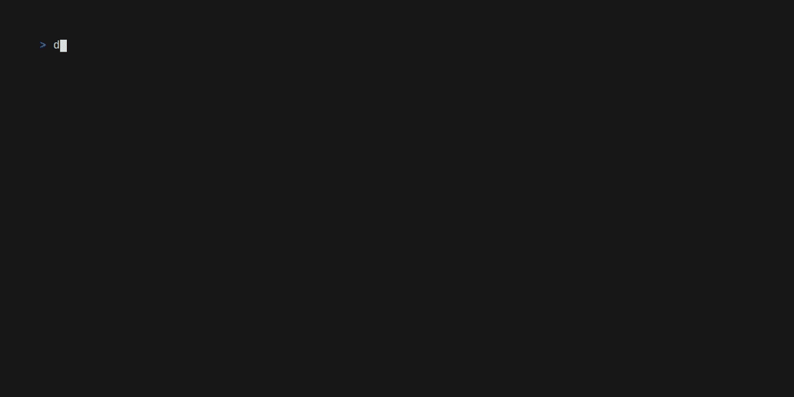

# Dot
[](https://github.com/opnlabs/dot/actions/workflows/main.yml) [](https://goreportcard.com/report/github.com/cvhariharan/dot) [](https://app.codacy.com/gh/opnlabs/dot/dashboard?utm_source=gh&utm_medium=referral&utm_content=&utm_campaign=Badge_coverage)

A minimal CI. Designed to be local first.

All the jobs run inside docker containers. `Dot` communicates with the Docker daemon using the [Docker client API](https://pkg.go.dev/github.com/docker/docker/client#section-readme).

Refer the project [wiki](https://github.com/opnlabs/dot/wiki) to learn more about dot.

<p align="center">
    
<p>

## Features
- Single binary, can run anywhere, on your machine or CI/CD systems
- Multi stage builds with support for build artifacts
- Simple yaml job definition
- Bring your own Docker images. Supports private registries
- Uses plain Docker

## Installation
Get the latest version from the [releases](https://github.com/opnlabs/dot/releases) section.

### Run using Docker
```bash
docker run -it -v /var/run/docker.sock:/var/run/docker.sock -v /path/to/project:/app ghcr.io/opnlabs/dot:latest -m
```

## Example
This example uses [GoReleaser](https://github.com/goreleaser/goreleaser) to build this project.
```yaml
stages:
  - test
  - security
  - build

jobs:
  - name: Run tests
    stage: test
    image: "docker.io/golang:1.21.3"
    variables:
      - TEST: true
    script:
      - go test ./...
    condition: TEST

  - name: Run checks
    stage: security
    image: "docker.io/golangci/golangci-lint:latest"
    script:
      - golangci-lint run ./...

  - name: Build using Goreleaser
    stage: build
    image: "docker.io/golang:1.21.3-bookworm"
    script:
      - git config --global safe.directory '*'
      - curl -sfL https://goreleaser.com/static/run | bash -s -- build --snapshot
    artifacts:
      - dist
```
Extract the binary once the build is complete.
```
tar xvf .artifacts/artifacts-*.tar
dist/dot_linux_amd64_v1/dot version
```
### Build Dot with Dot
This project can be built with `Dot`. The [dot.yml](dot.yml) file describes all the jobs necessary to build a linux binary. Clone the repo and run

```bash
go run main.go -m
```
This should create an artifact tar file in the `.artifacts` directory with the linux binary `dot`.
The `-m` flag gives `dot` access to the host's docker socket. This is required only if containers are created within `dot`.
<p align="center">
    
<p>

